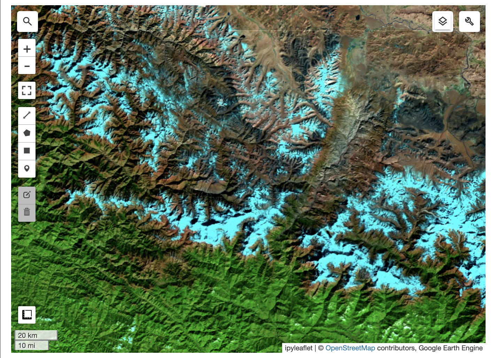
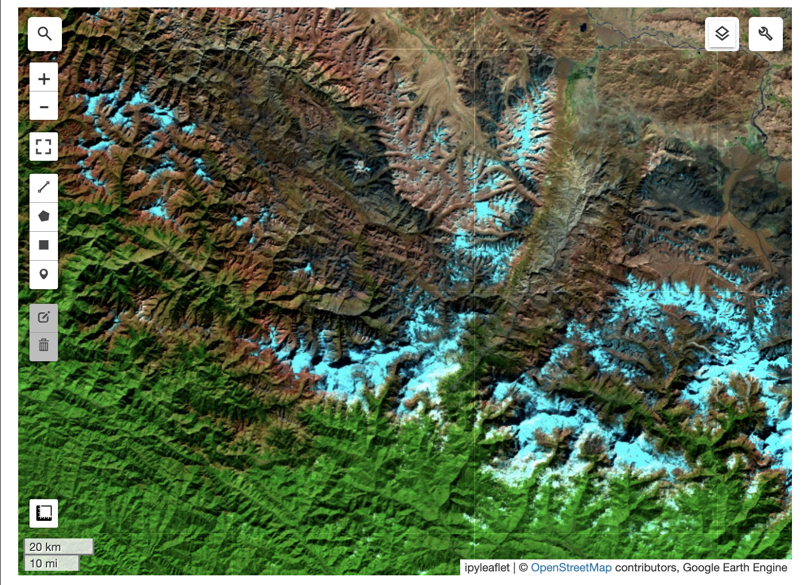
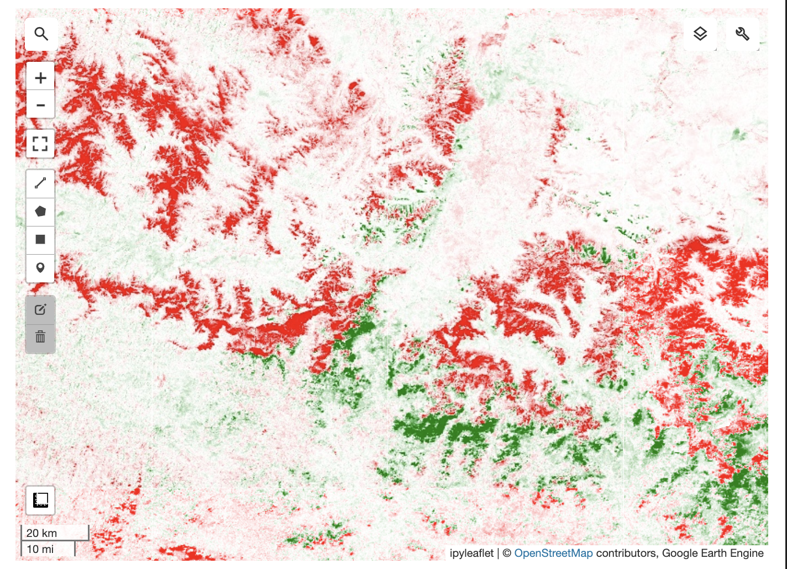
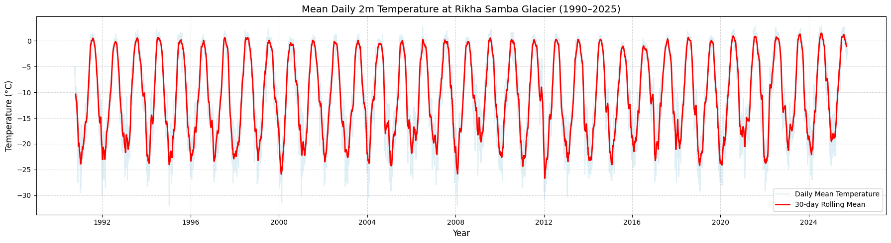

# Rikha Samba Glacier Analysis

## False Color Composite (FCC) Map

This analysis uses NASA–USGS **Landsat-8** satellite imagery accessed through **Google Earth Engine** to examine the **Rikha Samba Glacier** (28.823742° N, 83.490774° E) during winter for two time periods — **October to December 2013** and **October to December 2024**.  

A **False Color Composite (FCC)** was prepared using **Bands 7, 5, and 4** (mapped to RGB), which highlight rock, vegetation, and soil–water contrasts respectively.  

In the FCC:
- **Blue** tones represent glacial ice.  
- **White** areas indicate snow cover.  
- **Reddish-brown** regions correspond to exposed rock and debris.  
- **Bright red** hues show healthy vegetation, primarily south of the glacier.  
- **Dark shadowed** areas indicate steep slopes or thinly ice-covered surfaces.  

The 2024 image reveals **reduced snow and ice extent** compared to 2013, with more exposed debris and rock. A **difference map (2024 – 2013)** based on Band 5 reflectance shows significant snow and ice loss along the western and eastern flanks, with limited accumulation near the center.  

FCC imagery is invaluable for glacier monitoring as it visualizes spectral information beyond human vision — particularly in the **shortwave and near-infrared** regions — allowing detection of **glacial retreat, moraine changes,** and **surface composition** shifts with high precision.

**Images:**

---

## Time-Series Temperature Analysis (ERA5-Land)

Daily mean temperature data (2 m above surface) were extracted from **ERA5-Land** for the Rikha Samba region spanning **4 October 1990 – 30 September 2025**.  

The time-series plot shows a **gradual warming trend**, with the overall temperature curve shifting upward over time. The trend is **nonlinear**, marked by strong **interannual variability**. Winters in **1991, 2000, 2004, 2012,** and **2018** recorded similar low minima, while **post-2015** years show consistently higher winter lows — indicating a reduction in extreme cold events.  

A **30-day rolling average** highlights:
- An overall **increase in baseline temperature**.  
- **Greater variability** in minimum than maximum temperature.  

Such warming reduces glacial accumulation and enhances melt during warmer months. The observed **temperature rise** directly correlates with the **glacial retreat** seen in the FCC analysis, underscoring the vulnerability of Himalayan glaciers to even small changes in mean temperature.

**Image:**

---

*Data Sources:*  
- **Landsat-8** (NASA–USGS) via Google Earth Engine  
- **ERA5-Land** (Copernicus Climate Data Store)  
- **Open-Meteo API** (for historical temperature extraction)
